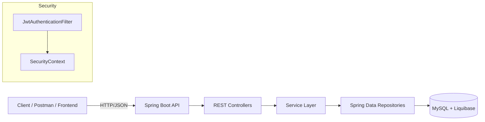

## Online Book Store API

A production-like **RESTful backend for an online book store**, built with **Spring Boot 3**, secured with **JWT**, documented via **OpenAPI/Swagger**, and backed by **MySQL + Liquibase** migrations.  
The project demonstrates a realistic e‑commerce flow: from user registration and authentication to browsing books, managing a shopping cart, and placing orders.

---

## Overview

The goal of this project is to build a compact but realistic backend for an online bookstore that:

- **Showcases clean layered architecture** (Controller → Service → Repository → Database).
- **Implements modern Spring Security with JWT** and role-based access (`USER`, `ADMIN`).
- Uses **database migrations (Liquibase)** and **schema validation** on startup.
- Emphasizes **clean DTOs, mapping, and API documentation**.

You can use this project as:

- **A learning example** of a more advanced Spring Boot application.
- **A starter template** for your own online store backend.
- **A portfolio project** to showcase Spring Boot + Security + JPA skills.

---

## Main Features

- **Authentication & Authorization**
  - User registration and login endpoints.
  - JWT token generation and verification.
  - Role-based access control with `@PreAuthorize`.

- **Book Catalog**
  - CRUD operations on books (admin only).
  - Paginated and sortable list of books.
  - Fetch a single book by id.

- **Categories**
  - CRUD operations on categories.
  - Fetch all categories with pagination.
  - Fetch all books by category id.

- **Shopping Cart**
  - Shopping cart bound to the currently authenticated user.
  - Add book to cart, update quantity, remove cart items.

- **Orders**
  - Create an order from the current user’s cart.
  - View list of user orders (paginated).
  - View items of a specific order, including a single order item.
  - Update order status.

- **Validation & Error Handling**
  - Request validation with `jakarta.validation`.
  - Custom validators (e.g. matching password fields).
  - Global exception handling with meaningful error responses.

---

## Tech Stack

- **Language & Platform**
  - Java 17
  - Spring Boot 3.2.2

- **Spring**
  - `spring-boot-starter-web` – REST API.
  - `spring-boot-starter-data-jpa` – data access layer.
  - `spring-boot-starter-security` – security and authorization.

- **Security / Auth**
  - JWT via `io.jsonwebtoken:jjwt-*`.
  - Method-level security with `@EnableMethodSecurity` and `@PreAuthorize`.
  - `JwtAuthenticationFilter` and `SecurityConfig`.

- **API Documentation**
  - `springdoc-openapi-starter-webmvc-ui` – automatic OpenAPI & Swagger UI.

- **Database & Migrations**
  - MySQL – main database.
  - H2 – in-memory database for tests.
  - Liquibase – database migrations (changelogs under `db/changelog`).

- **Data Layer**
  - Spring Data JPA repositories.
  - Entities such as `Book`, `Category`, `User`, `Role`, `ShoppingCart`, `CartItem`, `Order`, `OrderItem`.

- **Mapping & Boilerplate Reduction**
  - MapStruct – mapping between Entities and DTOs.
  - Lombok – getters/setters/builders, constructors, etc.

- **Code Quality**
  - Checkstyle – style and formatting.
  - JaCoCo – code coverage.
  - `spring-boot-starter-test`, `spring-security-test` – unit and integration testing support.

---

## Architecture at a Glance

The logical request flow:



- **Controllers** – define REST endpoints, accept/return DTOs and handle HTTP concerns.
- **Services** – encapsulate business logic (cart manipulation, ordering, role assignment, etc.).
- **Repositories** – interact with the database through JPA.
- **Security Layer** – JWT-based authentication, user details service, and method-level checks.

---

## REST API – Controllers Overview

> Note: All routes below are shown **without** the context path.  
> Actual base path: `http://localhost:8080/api`.

### AuthenticationController (`/auth`)

- **POST `/auth/registration`**
  - Register a new user.
  - Request body: `UserRegistrationRequestDto`.
  - Response: `UserResponseDto`, HTTP `201 CREATED`.

- **POST `/auth/login`**
  - Authenticate a user and issue a JWT token.
  - Request body: `UserLoginRequestDto`.
  - Response: `UserLoginResponseDto` (contains the JWT token).

### BookController (`/books`)

Read operations require `ROLE_USER`; management operations require `ROLE_ADMIN`.

- **GET `/books`**
  - Returns a paginated list of books.
  - Pageable parameters: `page`, `size`, `sort`.
  - Response: `Page<BookDto>`.

- **GET `/books/{id}`**
  - Returns a single book by id.

- **POST `/books`** (ADMIN)
  - Create a new book.
  - Request body: `CreateBookRequestDto`.
  - Response: `BookDto`, HTTP `201 CREATED`.

- **PUT `/books/{id}`** (ADMIN)
  - Update an existing book.
  - Request body: `CreateBookRequestDto`.

- **DELETE `/books/{id}`** (ADMIN)
  - Soft delete a book by id.

### CategoryController (`/categories`)

- **POST `/categories`** (ADMIN)
  - Create a new category.
  - Request body: `CategoryRequestDto`.
  - Response: `CategoryDto`, HTTP `201 CREATED`.

- **GET `/categories`** (USER)
  - Get all categories with pagination.

- **GET `/categories/{id}`** (USER)
  - Get a category by id.

- **PUT `/categories/{id}`** (ADMIN)
  - Update a category.
  - Request body: `CategoryRequestDto`.

- **DELETE `/categories/{id}`** (ADMIN)
  - Delete a category.

- **GET `/categories/{id}/books`** (USER)
  - Get books belonging to a specific category.
  - Response: `List<BookDtoWithoutCategoryIds>`.

### ShoppingCartController (`/cart`)

Always works with the **current authenticated user’s** cart.

- **GET `/cart`** (USER)
  - Get the current user’s shopping cart.
  - Response: `ShoppingCartDto`.

- **POST `/cart`** (USER)
  - Add a book to the shopping cart.
  - Request body: `AddToCartRequestDto`.
  - Response: updated `ShoppingCartDto`.

- **PUT `/cart/items/{cartItemId}`** (USER)
  - Update the quantity of an item in the cart.
  - Request body: `UpdateCartItemRequestDto`.
  - Response: updated `ShoppingCartDto`.

- **DELETE `/cart/items/{cartItemId}`** (USER)
  - Remove an item from the shopping cart.

### OrderController (`/orders`)

- **POST `/orders`**
  - Create an order from the current user’s shopping cart.
  - Request body: `CreateOrderRequestDto`.
  - Response: `OrderDto`.

- **GET `/orders`**
  - Get a paginated list of the current user’s orders.
  - Response: `Page<OrderDto>`.

- **PATCH `/orders/{orderId}`**
  - Update the status of an order.
  - Request param: `status` (`OrderStatus`).

- **GET `/orders/{orderId}/items`**
  - Get paginated list of items for a specific order.
  - Response: `Page<OrderItemDto>`.

- **GET `/orders/{orderId}/items/{itemId}`**
  - Get a specific item of an order.

---

## Security and JWT

- All endpoints except `/auth/**` are **secured**.
- Clients must send a valid JWT token in the header:

  - `Authorization: Bearer <JWT_TOKEN>`

- **Roles:**
  - `ROLE_USER` – can browse books and categories, manage own cart and orders.
  - `ROLE_ADMIN` – everything above plus full management of books and categories.

- **Security configuration highlights** (`SecurityConfig`):
  - CSRF disabled for stateless REST API.
  - `/auth/**` is permitted to everyone; all other requests require authentication.
  - `JwtAuthenticationFilter` is added before `UsernamePasswordAuthenticationFilter`.

- **JWT properties** are configured in `application.properties`:
  - `jwt.secret`
  - `jwt.expiration`

---

## Setup and Run

### Prerequisites

- Java 17+
- Maven 3+
- Running MySQL instance

### 1. Clone the repository

```bash
git clone <your-repository-url>
cd <project-directory>
```

### 2. Configure the database

Create a database (default name from `application.properties` is `myDb`):

```sql
CREATE DATABASE myDb CHARACTER SET utf8mb4 COLLATE utf8mb4_unicode_ci;
```

Check and adjust the properties in `src/main/resources/application.properties`:

- `spring.datasource.url=jdbc:mysql://localhost:3306/myDb`
- `spring.datasource.username=root`
- `spring.datasource.password=root`
- `spring.jpa.hibernate.ddl-auto=validate`
- `spring.liquibase.change-log=classpath:/db/changelog/db.changelog-master.yaml`

Liquibase will automatically apply all migrations on application startup.

### 3. Build and run

Using Maven:

```bash
mvn clean package
java -jar target/java-spring-0.0.1-SNAPSHOT.jar
```

Or directly:

```bash
mvn spring-boot:run
```

By default:

- Application port: `8080`
- Context path: `/api`
- Base API URL: `http://localhost:8080/api`

---

## API Documentation (Swagger / OpenAPI)

Once the application is running, open:

- Swagger UI: `http://localhost:8080/api/swagger-ui/index.html`

With Swagger UI you can:

- Browse all available endpoints and models.
- Try requests directly from the browser.
- Export the OpenAPI specification for client generation.

---

## Testing

Run the test suite:

```bash
mvn test
```

- Uses dedicated test configuration (H2 in-memory DB, etc.).
- Contains unit and integration tests for controllers and services.
- JaCoCo is configured in `pom.xml` to measure and enforce minimal coverage for key classes.

---

## Example Usage (Authentication Flow)

1. **Register a user**

```bash
curl -X POST "http://localhost:8080/api/auth/registration" \
  -H "Content-Type: application/json" \
  -d '{
    "email": "user@example.com",
    "password": "password123",
    "repeatPassword": "password123"
  }'
```

2. **Login and obtain a JWT**

```bash
curl -X POST "http://localhost:8080/api/auth/login" \
  -H "Content-Type: application/json" \
  -d '{
    "email": "user@example.com",
    "password": "password123"
  }'
```

Take the `token` value from the response.

3. **Access a protected resource**

```bash
curl -X GET "http://localhost:8080/api/books" \
  -H "Authorization: Bearer <JWT_TOKEN>"
```

---

## Postman Collection (Optional)

You can either:

- Import the API directly from **Swagger/OpenAPI** into Postman, or
- Provide a pre-built Postman collection in the repository, for example:
  - `postman/online-book-store.postman_collection.json`

Recommended workflow:

1. Open Swagger UI at `http://localhost:8080/api/swagger-ui/index.html`.
2. Export the OpenAPI spec.
3. Import it into Postman – it will generate a collection with all endpoints.
4. Optionally, commit the collection file and mention its path here in the README.

---

## Challenges and Lessons Learned

- **Spring Security + JWT integration**
  - Needed to properly wire `SecurityFilterChain`, `JwtAuthenticationFilter`, `AuthenticationManager`, and `UserDetailsService`.
  - Solution: clearly separate responsibilities and register the JWT filter before `UsernamePasswordAuthenticationFilter`, explicitly configuring permitted and secured routes.

- **Database design and Liquibase migrations**
  - The schema had to stay flexible enough for books, categories, carts, orders, roles, and users.
  - Solution: split migrations into domain-specific changelog files and aggregate them in a master changelog.

- **Entity–DTO mapping**
  - Manual mapping became repetitive very quickly.
  - Solution: employ **MapStruct** and move all mapping logic into dedicated `mappers` classes.

- **Validation and unified error format**
  - It was important to provide clear messages for clients.
  - Solution: custom exceptions such as `EntityNotFoundException`, `RegistrationException`, etc., combined with a global exception handler.

- **Code quality and test coverage**
  - Enforcing style and coverage thresholds highlighted weak spots in the code.
  - Solution: integrate Checkstyle and JaCoCo into the Maven build and treat violations as build-breaking issues.

---

## Video explain

https://www.loom.com/share/874f424a8af04beca94cb82f7741887f

## Conclusion

This project is a complete and extensible **backend for an online bookstore**, showing:

- Modern **Spring Boot 3 + Security + JPA + JWT** stack in action.
- Production-friendly **database migration** and **API documentation** setup.
- Application of **clean architecture** and **testing best practices**.